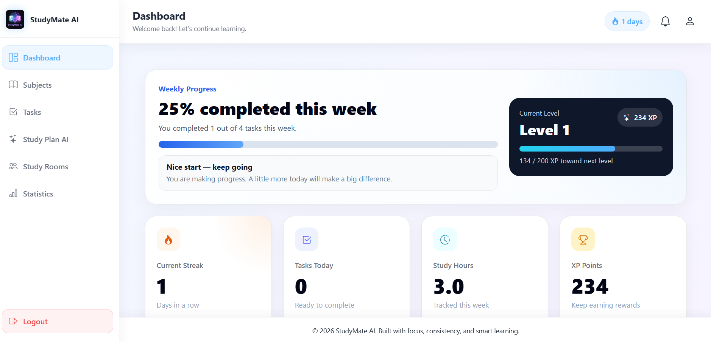
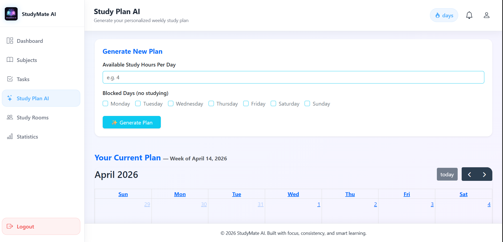
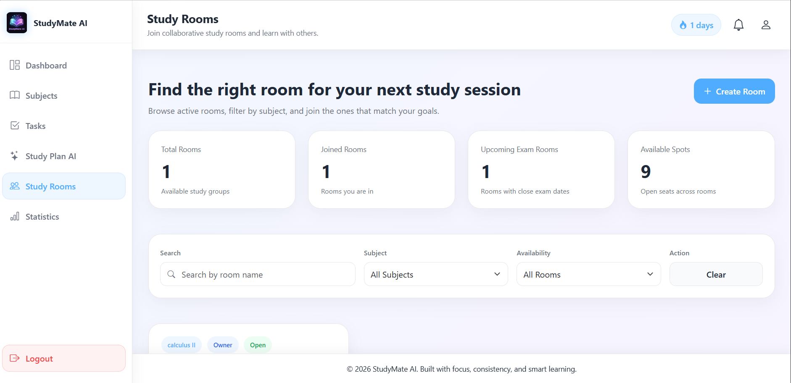
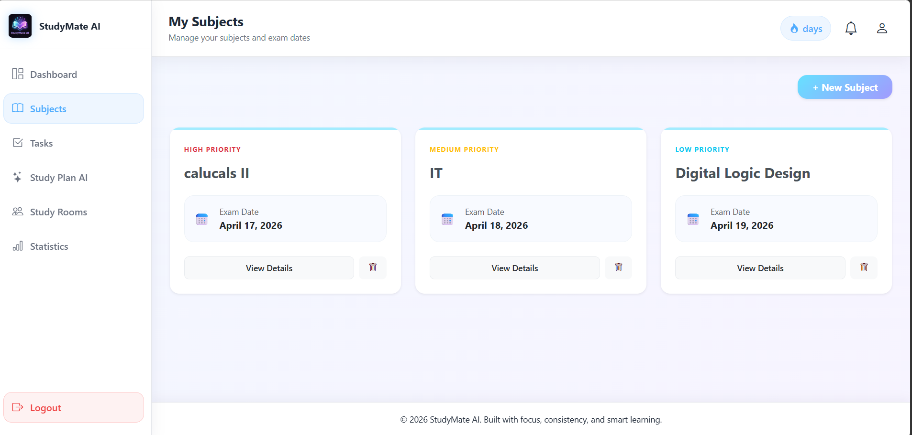
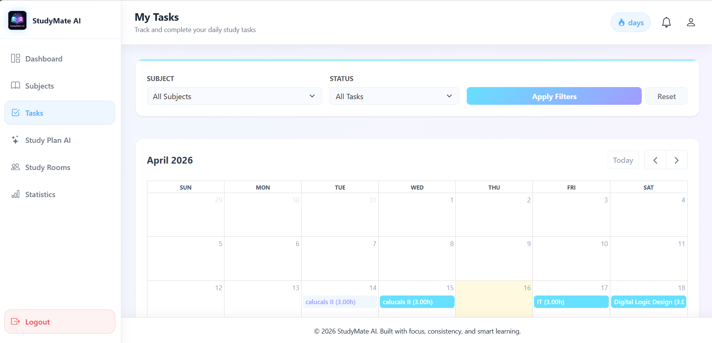
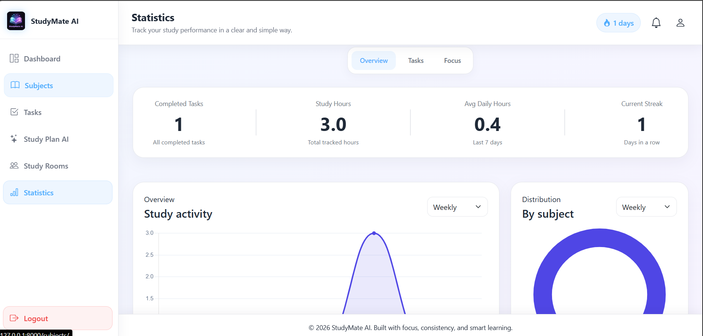
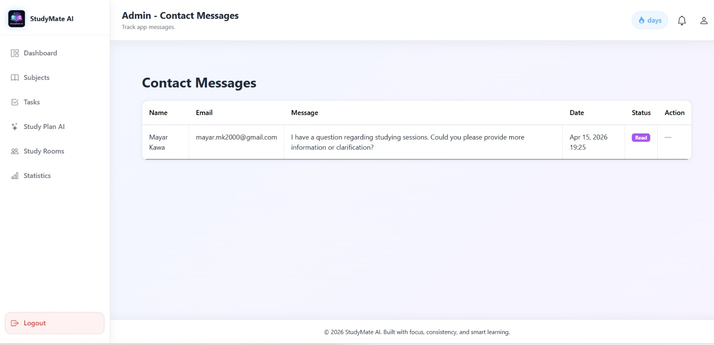
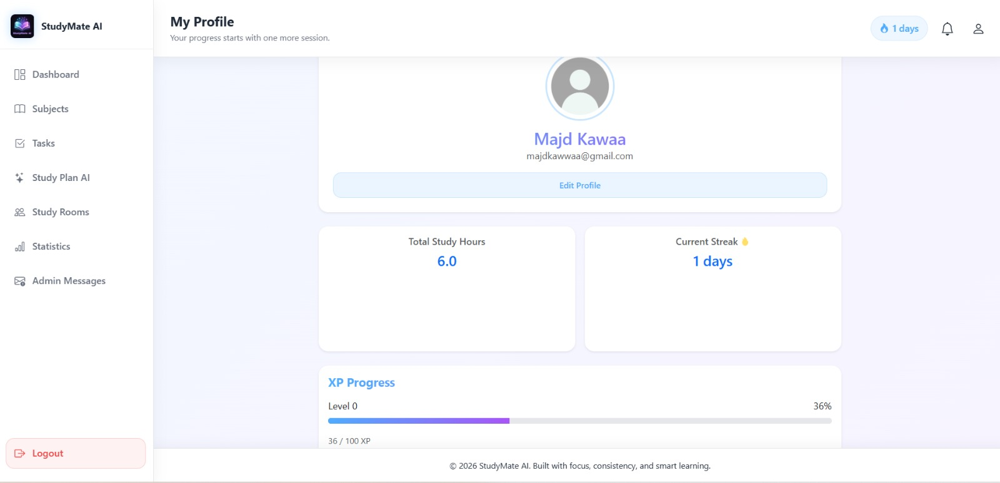

# 📚 StudyMate AI

> An AI-powered smart study planner designed for students to organize subjects, generate personalized study plans, and track daily tasks.

---

## 🚀 Live Demo
> The project is successfully deployed on AWS and accessible at:
> http://13.49.241.149/ ← Click to view live

---

## 📖 Project Overview

StudyMate AI is a web-based platform that helps students manage their study schedule efficiently. Students can add their subjects and exam dates, generate an AI-powered weekly study plan, and track their daily tasks with a simple done/pending toggle.

---

## ✨ Features

- 🔐 User Registration & Login with session-based authentication
- 📚 Subjects Management — add, edit, delete subjects with priority and exam dates
- 🤖 AI Study Plan Generation — personalized weekly plan based on subjects and available hours
- ✅ Tasks Page — view all tasks with AJAX done/pending toggle
- 📊 Dashboard — progress overview and streak tracking
- 📧 Email notifications for study reminders
- 🏆 Study Rooms — join or create rooms by subject with XP and earning badges
-   Gamification - Badges, XP & Streaks
- 📱 Fully responsive design using Bootstrap 5

---
## 🖼️ Screenshots
| Dashboard | Study Plan | Study Rooms |
|-----------|------------|-------------|
|  |  |  |

| Subjects | Tasks | Statistics |
|----------|-------|------------|
|  |  |  |

| Contact Us | Profile |
|------------|---------|
|  |  |

---
## 🛠️ Tech Stack

| Technology | Usage |
|---|---|
| Python / Django | Backend framework |
| MySQL | Database |
| Bootstrap 5 | Frontend styling |
| JavaScript / AJAX | Dynamic interactions |
| GROQ API | AI study plan generation |
| SMTP | Contact us Email |
| AWS | Deployment |
| Git / GitHub | Version control |

---

## 📁 Project Structure
Study-Mate-Ai/
├── study_mate_ai/        # Django project settings
│   ├── settings.py
│   ├── urls.py
│   └── wsgi.py
├── study_mate_app/       # Main application
│   ├── models.py         # Database models
│   ├── views.py          # Application logic
│   ├── urls.py           # URL routing
│   ├── forms.py          # Django forms
│   ├── admin.py          # Admin configurations
│   ├── templates/        # HTML templates
│   │   ├── base.html
│   │   ├── auth.html
│   │   ├── home.html
│   │   ├── dashboard.html
│   │   ├── subjects/
│   │   ├── study_plan/
│   │   ├── tasks/
│   │   └── rooms/
│   └── static/
│       ├── css/
│       ├── js/
│       └── images/
├── requirements.txt
├── .env
├── .gitignore
├── manage.py
└── README.md
---

## 🗄️ Database Models

- *User* — Authentication and profile data
- *Subject* — Study subjects
- *UserSubject* — Links users to subjects with exam date and priority
- *StudyPlan* — AI generated weekly plan
- *StudyPlanItem* — Individual daily tasks from the plan
- *StudySession* — Logged study sessions
- *ProgressSummary* — Weekly progress tracking
- *Notification* — Email notification records
- *StudyRoom* — Community study rooms
- *RoomMember* — Room membership
- *ContactMessage*
- *Badge*
- *UserBadge*

---

## ⚙️ Installation & Setup

# 1. Clone repo
git clone https://github.com/MunawwarQamar/Study-Mate-Ai.git
cd Study-Mate-Ai

# 2. Create virtual environment
python -m venv env
env\Scripts\activate  # Windows
source env/bin/activate  # Mac/Linux

# 3. Install dependencies
pip install -r requirements.txt

# 4. Create .env file (see below)
cp .env.example .env  # if you have an example file

# 5. Run migrations
python manage.py makemigrations
python manage.py migrate

# 6. Create superuser (optional)
python manage.py createsuperuser

# 7. Start server
python manage.py runserver

# 8. Visit http://127.0.0.1:8000

---

## 🚧 Future Improvements

- Mobile app version
- Pomodoro timer
- PDF export plans
- Smart analytics with AI
- Integration with Google Calendar and academic/LMS platforms
- Integration with online learning platforms like YouTube Learning
- Enhanced Study Rooms with video calls, file sharing, and AI moderation
- AI-generated mock exams for practice and self-evaluation

---

## 👥 Team

| Name | Role |
|------|------|
| Majd | Login & Registration, Profile Page, Contact Us Page, Public Base Layout |
| Basel | Subjects Page, AI Study Plan Page, Tasks Page |
| Munnawwar | Dashboard Page, Statistics Page, Study Rooms Page |

---

📅 Project Timeline
Built in 10 days as part of Axsos Academy Group Project — April 2026

---

## 📄 License
This project is for educational purposes.
 

 ---
